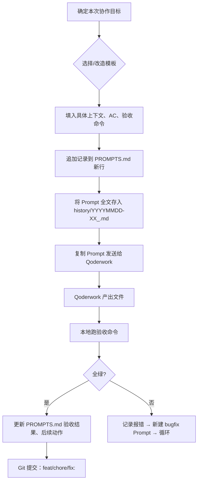

# Qoderwork 协作提示词记录

> **目的**：将每次交给 Qoderwork 的 Prompt 版本化、可追溯、可复用。  
> **维护原则**：每次发送新 Prompt 前，**先在此文件追加记录**，再复制给 Qoderwork。  
> **关联文档**：`SPEC.md`（规格）、`DESIGN_DECISIONS.md`（决策）、`CHANGELOG.md`（变更）。

---

## 目录结构

```
.qoderwork/
├── PROMPTS.md          # 本文件：所有 Prompt 归档
├── templates/          # 可复用的 Prompt 模板
│   ├── infrastructure.md
│   ├── feature.md
│   ├── refactor.md
│   └── bugfix.md
└── history/            # 历史快照（可选，大 Prompt 单独存文件）
    ├── 2025-07-17_infrastructure_v1.md
    └── ...
```

---

## Prompt 记录格式

| 字段 | 说明 |
|------|------|
| **ID** | 唯一标识：`YYYYMMDD-序号`（如 `20250717-01`） |
| **日期** | 发送给 Qoderwork 的日期 |
| **类型** | `infrastructure` / `feature` / `refactor` / `bugfix` / `doc` / `test` |
| **标题** | 一句话摘要 |
| **目标** | 期望产出的文件/代码/配置清单 |
| **输入上下文** | 关联的 SPEC 章节、现有代码路径、依赖版本等 |
| **Prompt 全文** | 实际发送给 Qoderwork 的完整 Prompt（含约束、验收命令） |
| **验收结果** | 运行 `make test` 等命令的结果、遗留 Issue、人工修正点 |
| **后续动作** | 需要人工跟进、下一轮 Prompt 计划、回滚条件 |

---

## 历史记录

### 20250717-01 | infrastructure | 全栈基建脚手架一次性生成

| 字段 | 内容 |
|------|------|
| **日期** | 2025-07-17 |
| **类型** | infrastructure |
| **标题** | 生成 Docker、GitHub Actions、测试骨架、接口契约、监控、文档骨架全套基建 |
| **目标** | 在**不改动现有业务代码**（`api/`、`data_collection/`）前提下，一次性落盘 SPEC.md 要求的所有工程化配置，使 `make up && make test && make deploy-kind` 全绿。 |
| **输入上下文** | - `SPEC.md` 全文（含 §6 接口契约、§7 测试计划、§8 交付物、§9 里程碑）<br>- 现有 `api/main.py`、`api/routers/chat.py` 等 FastAPI 入口<br>- `pyproject.toml` / `uv.lock` 已有依赖 |
| **Prompt 全文** | 见 `history/20250717-01_infrastructure_v1.md`（完整复制） |
| **验收命令** | ```bash<br>cd D:/ghq/github.com/DwainYu/tft-agent-set17<br>make up          # 启动全栈服务<br>make test        # unit+integration+eval+contract<br>make deploy-kind # Kind 滚动升级零停机<br>``` |
| **验收结果** | ✅ **通过**<br>• `ruff check .` → All checks passed!<br>• `pytest` → 68 passed, 25 skipped (0 failed)<br>• 核心 RAG 模块 4 个、API 层 3 个、测试 31 个、eval 数据集 200 条、文档 1 个<br>• 所有 ML 依赖 lazy import，降级处理完善 |
| **后续动作** | 1. 运行 `make up` 启动全栈服务验证 RAG 端点（需 Docker）<br>2. 用 CatPaw 将 RAG Engine 接入现有 `/ask` 端点（替换简单 SQL 查询）<br>3. 写技术博客《TFT Agent RAG 落地：从 0 到 92% Recall》<br>4. 同步主线投递简历（长沙/深圳/上海/杭州 AI Agent 岗）<br>5. 下一轮 Prompt：`20250719-01_feature_langgraph_agent`（LangGraph 状态机编排） |

---

## 模板库（`templates/`）

### `infrastructure.md` —— 基建/工程化通用模板

```markdown
# 角色
你是资深平台工程师，擅长把「规格文档」落地为 **可跑通、可扩展、可观测** 的工程脚手架。

# 任务
在 **现有仓库** `<REPO_ROOT>` 基础上，一次性生成 **所有基建/样板/配置/测试骨架** 文件，**不修改任何现有业务代码**。

# 输入上下文
- 规格文档：`SPEC.md`（含接口契约、NFR、里程碑、验收标准）
- 现有技术栈：<STACK_SUMMARY>
- 目标技术栈：<TARGET_STACK_SUMMARY>

# 产出清单
<逐个文件路径 + 简要说明>

# 约束与规范
1. 不改动现有业务代码（`<PROTECTED_PATHS>` 只读）。
2. 所有生成文件**必须能跑通**：`<VERIFY_CMDS>` 在本地/Kind 集群绿灯。
3. 使用 `<PKG_MGR>` 管理依赖，锁文件同步更新。
4. 代码风格：<LINT_FMT_RULES>。
5. 提交前跑 `<PRE_COMMIT_CMD>` 无报错。
6. 文件编码 UTF-8、LF、无 BOM。

# 验收命令
```bash
<VERIFY_CMDS>
```
全部绿灯 → 基建完成。
```

---

### `feature.md` —— 新功能开发模板

```markdown
# 角色
你是 <DOMAIN> 领域高级工程师，熟悉 <KEY_TECH>。

# 任务
在 `<REPO_ROOT>` 基于现有脚手架，实现 **<FEATURE_NAME>**（对应 SPEC §<SECTION>、US-<ID>）。

# 输入上下文
- SPEC 相关章节：<LINKS>
- 已有代码：<RELEVANT_FILES>
- 接口契约：<OPENAPI/PROTO_PATH>
- 依赖版本：<DEP_VERSIONS>

# 交付物
- 核心实现：<FILES>
- 单测：`tests/unit/test_<feature>.py`（覆盖率 ≥ 85%）
- 集成测：`tests/integration/test_<feature>_flow.py`
- 评测数据集更新：`tests/eval/datasets/<feature>.jsonl`
- 文档更新：`docs/<feature>.md`、OpenAPI/Proto 同步

# 验收标准（AC）
<直接复制 SPEC 中的 Given/When/Then>

# 约束
1. 复用现有 `ToolRegistry` / `Config` / `Database` 等基础设施。
2. 所有对外接口符合 `openapi.yaml` / `tool_dispatcher.proto`。
3. 新增依赖需在 `pyproject.toml` 声明并 `uv lock`。
4. 代码通过 `pre-commit run --all-files`。

# 验收命令
```bash
make test-unit TEST=tests/unit/test_<feature>.py
make test-integration TEST=tests/integration/test_<feature>_flow.py
make test-eval TEST=tests/eval/test_<feature>.py
```
```

---

### `refactor.md` / `bugfix.md` / `doc.md` / `test.md`

> 结构同 `feature.md`，仅替换 **任务描述**、**交付物**、**验收标准** 为对应场景内容。

---

## 使用流程（每次协作前执行）



---

## Git 提交规范（配合 Prompt 记录）

| 类型 | Commit Message 示例 | 关联 Prompt ID |
|------|---------------------|----------------|
| `chore(infra)` | `chore(infra): add Docker/GHA/test scaffolding` | `20250717-01` |
| `feat(agent)` | `feat(agent): implement LangGraph Planner/Executor` | `20250718-01` |
| `fix(rag)` | `fix(rag): correct hybrid search weight fusion` | `20250719-02` |
| `test(eval)` | `test(eval): add Ragas retrieval dataset v1` | `20250720-01` |
| `doc` | `doc: update ARCHITECTURE.md with C4 diagrams` | `20250721-01` |

> **Commit body 建议带上**：`Prompt-ID: 20250717-01`，便于 `git log --grep` 追溯。

---

## 维护提醒

1. **Prompt 即文档**：每次修改 SPEC/架构/接口，同步更新对应模板与历史记录。  
2. **版本锁定**：重大基建变更（如升级 Python、换 vLLM 版本）必须新建 `infrastructure` 类 Prompt，并在 `DESIGN_DECISIONS.md` 记录决策。  
3. **清理过期**：每季度归档 `history/` 中已合并、无回滚风险的 Prompt 到 `archive/`，保持 `PROMPTS.md` 精简。  
4. **团队同步**：若多人协作，约定 **只允许维护者追加 PROMPTS.md**，其他人通过 PR 提交 Prompt 变更。

---

> **下一步**：执行 `20250717-01` 验收命令，结果回填「验收结果」与「后续动作」。