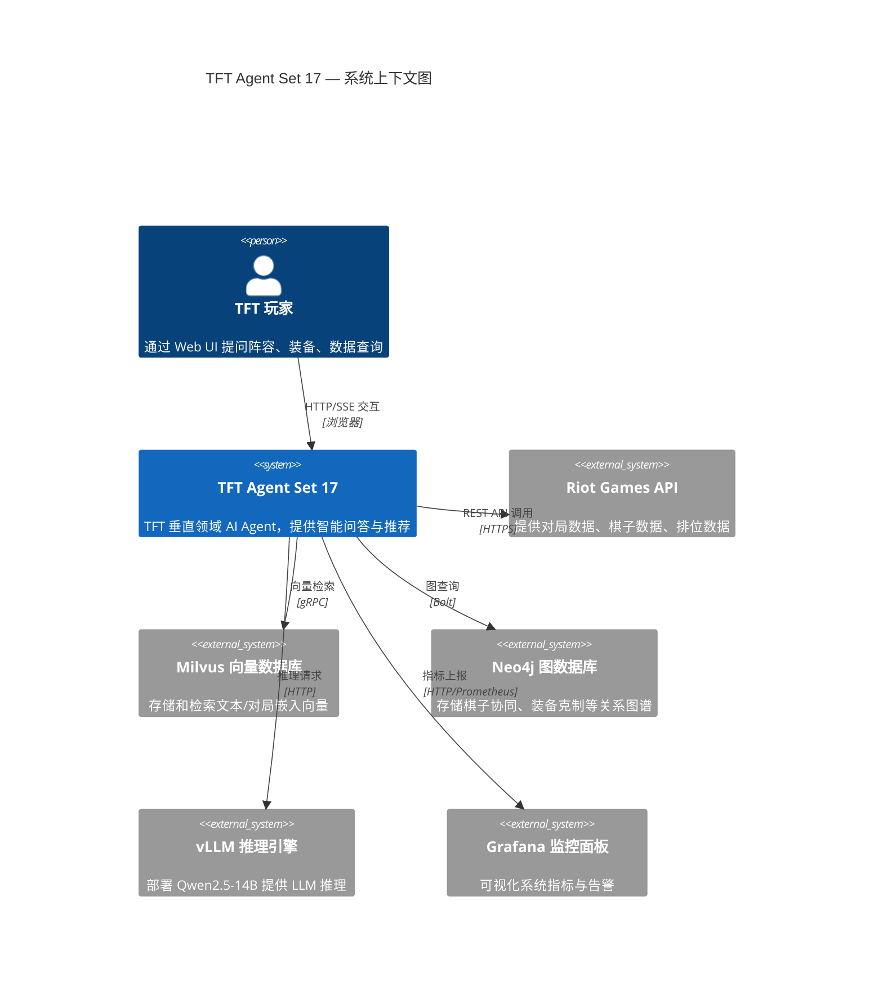
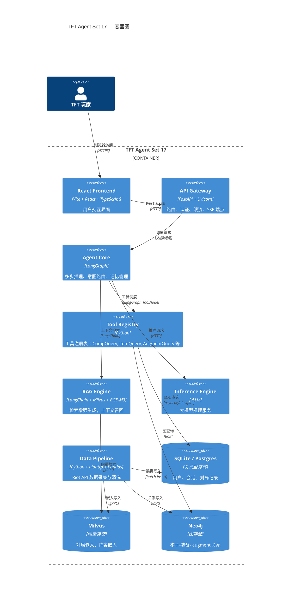
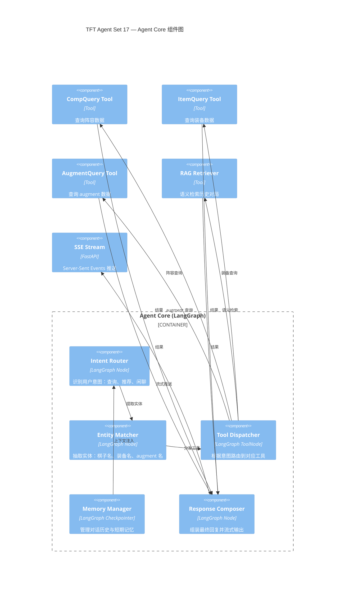
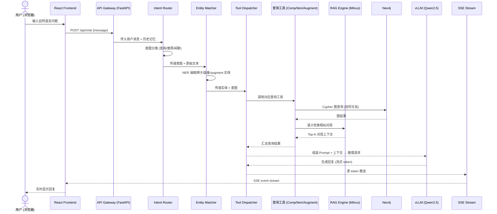

# 系统架构文档 — TFT Agent Set 17

> 最后更新: 2025-07 | 维护者: @DwainYu

---

## 1. 系统概述

TFT Agent Set 17（"云顶虾神"）是一款面向 **Teamfight Tactics (TFT) Set 17 "Space Gods"** 赛季的垂直领域 AI Agent 平台。系统覆盖从数据采集、向量化存储、语义检索、大模型推理到阵容推荐的 **全链路智能决策**，核心目标：

- **实时数据采集** — 通过 Riot API 抓取对局、棋子、装备、_augment_ 等数据
- **向量化检索** — 利用 BGE-M3 将非结构化数据嵌入 Milvus，实现语义搜索
- **知识图谱** — Neo4j 存储棋子协同、装备克制等图关系
- **大模型推理** — vLLM 部署 Qwen2.5-14B-Instruct-AWQ，提供自然语言交互
- **Agent 编排** — LangGraph 构建多步推理、工具调度、记忆管理的 Agent 工作流
- **可观测性** — Prometheus + Grafana + LangSmith 全栈监控

---

## 2. C4 模型

### 2.1 Context Diagram — 系统上下文



### 2.2 Container Diagram — 容器视图



### 2.3 Component Diagram — 组件视图



---

## 3. 数据流序列图



---

## 4. 技术栈

| 层级 | 技术选型 | 版本 | 用途 |
|------|---------|------|------|
| **前端** | React + TypeScript + Vite | React 18 / Vite 6 | 用户交互界面 |
| **API 网关** | FastAPI + Uvicorn | FastAPI 0.115+ / Uvicorn 0.32+ | REST + SSE 端点 |
| **Agent 框架** | LangGraph | 0.2+ | 有状态多步推理编排 |
| **工具注册** | LangGraph ToolNode | — | 工具调度与执行 |
| **向量数据库** | Milvus | 2.4+ | 嵌入向量存储与检索 |
| **图数据库** | Neo4j | 5.x | 棋子/装备/augment 关系图谱 |
| **LLM 推理** | vLLM | 0.6+ | 高吞吐 LLM serving |
| **基座模型** | Qwen2.5-14B-Instruct-AWQ | — | 中文优化的指令微调模型 |
| **嵌入模型** | BGE-M3 (BAAI) | — | 多语言、多粒度嵌入 |
| **关系数据库** | SQLite (dev) → Postgres (prod) | SQLite 3 / PG 16 | 用户、会话、对局存储 |
| **数据采集** | aiohttp + Pandas | aiohttp 3.14 / Pandas 3.0 | Riot API 爬虫 |
| **认证** | python-jose + passlib | — | JWT + bcrypt 认证 |
| **包管理** | uv | 0.5+ | 快速依赖管理 |
| **代码质量** | Ruff + Black + mypy | — | lint / format / type-check |
| **CI/CD** | GitHub Actions | — | 自动化测试与部署 |
| **监控** | Prometheus + Grafana | Prom 2.x / Grafana 11 | 指标采集与可视化 |
| **追踪** | LangSmith | — | LLM 调用链追踪 |
| **容器化** | Docker + Docker Compose | — | 开发环境编排 |
| **K8s** | Kind (staging) / EKS/GKE (prod) | — | 生产环境编排 |

---

## 5. 部署架构

### 5.1 开发环境 — Docker Compose

```
┌─────────────────────────────────────────────────┐
│              Docker Compose (dev)                 │
│                                                   │
│  ┌──────────┐  ┌──────────┐  ┌───────────────┐  │
│  │ Frontend │  │ API      │  │ Data Pipeline │  │
│  │ (Vite)   │  │ (FastAPI)│  │ (Collector)   │  │
│  │ :5173    │  │ :8000    │  │ cron/manual   │  │
│  └──────────┘  └──────────┘  └───────────────┘  │
│  ┌──────────┐  ┌──────────┐  ┌───────────────┐  │
│  │ SQLite   │  │ Milvus   │  │ Neo4j         │  │
│  │ (volume) │  │ :19530   │  │ :7474/:7687   │  │
│  └──────────┘  └──────────┘  └───────────────┘  │
│  ┌──────────┐  ┌──────────┐  ┌───────────────┐  │
│  │ vLLM     │  │Prometheus│  │ Grafana       │  │
│  │ :8001    │  │ :9090    │  │ :3001         │  │
│  └──────────┘  └──────────┘  └───────────────┘  │
└─────────────────────────────────────────────────┘
```

### 5.2 Staging — Kind (Kubernetes in Docker)

- 使用 Kind 创建本地 K8s 集群
- Helm Charts 部署各服务
- 镜像推送到 GHCR (`ghcr.io/dwainyu/tft-agent-set17`)
- ArgoCD 或 Flux 实现 GitOps 自动部署

### 5.3 Production — EKS / GKE

- **计算**: GPU 节点池 (A10G/L4) 用于 vLLM；CPU 节点池用于 API 和数据库
- **存储**: EBS/GCE PD 用于 Postgres；S3/GCS 用于 Milvus 对象存储
- **网络**: ALB/GCLB → API Gateway → 内部服务
- **自动扩缩**: HPA 根据 CPU/QPS 扩 API；KEDA 根据队列深度扩 Pipeline
- **安全**: Cert-Manager TLS，Sealed Secrets，RBAC，Network Policies
- **灾备**: Postgres 多 AZ 主从；Milvus 多副本；跨区备份

---

## 6. 安全考量

- JWT 认证 + bcrypt 密码哈希
- Riot API Key 通过 Secrets Manager 管理，不提交到代码仓库
- 所有外部通信走 HTTPS
- RBAC 控制 Agent 工具权限
- LangSmith trace 脱敏处理用户 PII

---

## 7. 演进路线

| 阶段 | 里程碑 | 核心交付 |
|------|--------|---------|
| Phase 1 (当前) | 基础骨架 + CI | FastAPI + React + SQLite + 工具注册表 |
| Phase 2 | Agent 核心 | LangGraph 编排 + LangSmith 追踪 |
| Phase 3 | 数据增强 | Milvus + Neo4j + BGE-M3 嵌入管线 |
| Phase 4 | 推理部署 | vLLM + AWQ 量化 + GPU 调度 |
| Phase 5 | 生产就绪 | K8s + 监控 + 告警 + 灰度发布 |
