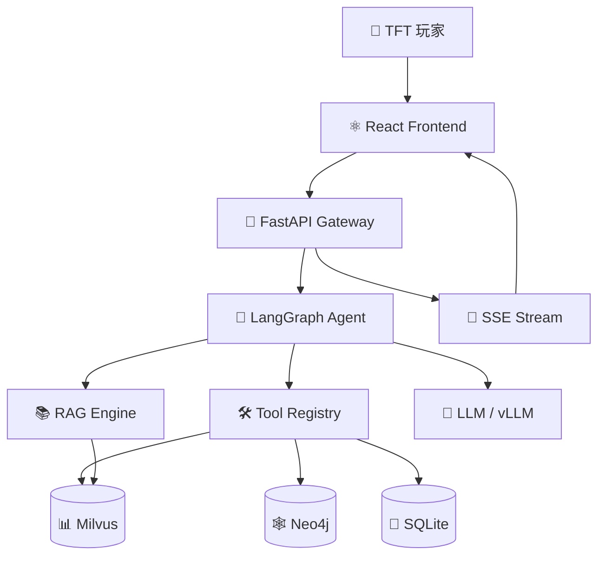
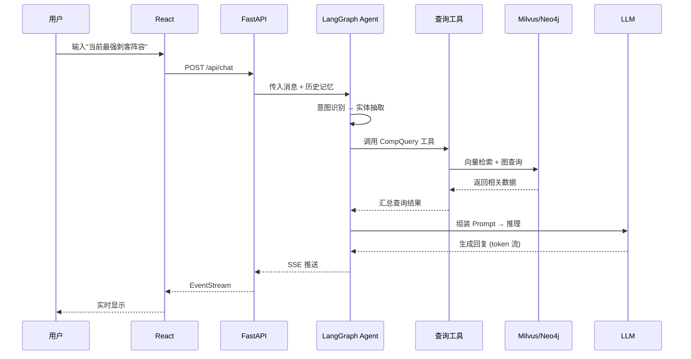

# TFT Agent Set 17

> **云顶之弈 (TFT) Set 17 "Space Gods" 垂直领域 AI Agent 平台**

基于 LangGraph + FastAPI + RAG 的智能阵容推荐与数据分析系统，覆盖从数据采集、向量化检索到大模型推理的全链路。

[](LICENSE)
[](https://www.python.org/downloads/)
[](https://fastapi.tiangolo.com/)
[](https://langchain-ai.github.io/langgraph/)
[](https://github.com/astral-sh/ruff)

## 功能特性

- **🎮 TFT 阵容推荐** — 输入自然语言问题，获取当前版本最强阵容、装备搭配、运营节奏推荐
- **🔍 智能检索** — BGE-M3 嵌入 + Milvus 向量检索，语义搜索历史对局与数据
- **📊 知识图谱** — Neo4j 存储棋子协同、装备克制等关系图谱
- **🤖 Agent 编排** — LangGraph 多步推理、工具调度、Human-in-the-loop 中断/修正
- **⚡ 流式响应** — SSE (Server-Sent Events) 实时推送 Token 流
- **🛠 工具注册** — CompQuery、ItemQuery、AugmentQuery 等查询工具
- **🔐 认证系统** — JWT + bcrypt 用户认证与权限控制
- **📈 可观测性** — Prometheus + Grafana 监控面板，LangSmith 链路追踪

## 技术栈

| 层级 | 技术 | 用途 |
|------|------|------|
| **前端** | React + TypeScript + Vite + TailwindCSS | 用户交互界面 |
| **API 网关** | FastAPI + Uvicorn | REST + SSE 端点 |
| **Agent 框架** | LangGraph | 有状态多步推理编排 |
| **向量数据库** | Milvus 2.4+ | 嵌入向量存储与检索 |
| **图数据库** | Neo4j 5.x | 棋子/装备关系图谱 |
| **LLM 推理** | vLLM / OpenAI 兼容接口 | 大模型推理服务 |
| **嵌入模型** | BGE-M3 (BAAI) | 多语言、多粒度嵌入 |
| **数据库** | SQLite (dev) / PostgreSQL (prod) | 用户、会话、对局存储 |
| **认证** | python-jose + passlib | JWT 认证 |
| **包管理** | uv | 快速依赖管理 |
| **代码质量** | Ruff + Black + mypy | lint / format / type-check |
| **容器化** | Docker + Docker Compose | 开发环境编排 |
| **监控** | Prometheus + Grafana | 指标采集与可视化 |
| **追踪** | LangSmith | LLM 调用链追踪 |

## 系统架构



### 核心数据流



## 项目结构

```
tft-agent-set17/
├── api/                      # FastAPI 后端服务
│   ├── main.py               # 应用入口
│   ├── config.py             # 配置管理
│   ├── database.py           # 数据库连接
│   ├── routers/              # API 路由
│   │   ├── chat.py           # 聊天端点 (SSE)
│   │   ├── auth.py           # 认证路由
│   │   ├── conversations.py  # 会话管理
│   │   └── rag.py            # RAG 查询
│   ├── agent/                # LangGraph Agent
│   │   ├── graph.py          # Agent 图定义
│   │   ├── nodes.py          # 节点实现
│   │   ├── tools.py          # 工具注册
│   │   └── llm.py            # LLM 集成
│   ├── services/             # 业务逻辑
│   │   ├── comp_query.py     # 阵容查询
│   │   ├── item_query.py     # 装备查询
│   │   ├── entity_matcher.py # 实体匹配
│   │   ├── intent_router.py  # 意图路由
│   │   └── rag/              # RAG 引擎
│   └── models/               # Pydantic 模型
├── frontend/                 # React 前端应用
│   ├── src/
│   │   ├── components/       # UI 组件
│   │   ├── hooks/            # 自定义 Hooks
│   │   ├── context/          # React Context
│   │   └── api/              # API 客户端
│   └── package.json
├── data/                     # 数据目录
│   ├── tft.db                # SQLite 数据库
│   ├── checkpoints.db        # Agent Checkpoint
│   └── corpus/               # 语料库
├── scripts/                  # 数据脚本
│   ├── ingest_milvus.py      # 数据导入 Milvus
│   ├── ingest_neo4j.py       # 数据导入 Neo4j
│   ├── generate_corpus.py    # 生成语料
│   └── mine_comps.py         # 挖掘阵容
├── tests/                    # 测试套件
│   ├── unit/                 # 单元测试
│   ├── integration/          # 集成测试
│   ├── eval/                 # 评测测试
│   └── contract/             # 契约测试
├── infra/                    # 基础设施
│   ├── k8s/                  # K8s 部署配置
│   └── monitoring/           # 监控配置
├── docs/                     # 文档
├── docker-compose.yml        # 开发环境编排
├── Makefile                  # 常用命令
└── pyproject.toml            # Python 项目配置
```

## 快速开始

### 环境要求

- Python 3.11+
- Docker & Docker Compose
- uv (推荐，用于依赖管理)

### 安装依赖

```bash
# 使用 uv 安装
uv sync

# 或使用 pip
pip install -e ".[dev]"
```

### 配置环境变量

```bash
cp .env.example .env
# 编辑 .env，填入实际配置值
```

必需配置项：
- `RIOT_API_KEY` — [Riot Developer Portal](https://developer.riotgames.com/) 申请
- `JWT_SECRET` — 用于 JWT 签名的密钥
- `DB_PATH` — SQLite 数据库路径（默认 `data/tft.db`）

### 启动服务

```bash
# 启动所有服务（Docker Compose）
make up

# 或单独启动后端
uvicorn api.main:app --reload --host 0.0.0.0 --port 8000

# 启动前端开发服务器
cd frontend && npm install && npm run dev
```

服务启动后访问：
- **API**: http://localhost:8000
- **API Docs**: http://localhost:8000/docs
- **Frontend**: http://localhost:5173
- **Grafana**: http://localhost:3001

### 数据导入

```bash
# 导入数据到 Milvus
python scripts/ingest_milvus.py

# 导入数据到 Neo4j
python scripts/ingest_neo4j.py
```

## API 接口

### 聊天接口

```http
POST /api/chat
Content-Type: application/json
Authorization: Bearer <token>

{
  "message": "当前版本最强刺客阵容是什么？",
  "conversation_id": "optional-conversation-id"
}
```

响应：SSE 流式返回

```
event: stage_start
data: {"stage": "planning"}

event: tool_call
data: {"tool": "comp_query", "args": {"tier": "s"}}

event: token
data: {"token": "当前版本最强刺客阵容为"}

event: done
data: {"finish": true}
```

### 健康检查

```http
GET /health
```

### 认证接口

```http
POST /auth/register
POST /auth/login
POST /auth/refresh
```

## 测试

```bash
# 运行全部测试
pytest

# 仅运行单元测试
pytest -m unit

# 仅运行集成测试
pytest -m integration

# 仅运行评测测试
pytest -m eval

# 查看覆盖率
pytest --cov=api --cov-report=html
```

## 代码质量

```bash
# Lint
make lint

# 格式化
make fmt

# Pre-commit 检查
make pre-commit
```

## 部署

### Docker Compose (开发/Staging)

```bash
make up          # 启动所有服务
make down        # 停止所有服务
make logs        # 查看日志
```

### Kubernetes

```bash
# 部署到 Kind 集群
make deploy-kind

# 或使用 Helm
helm upgrade --install tft-agent infra/k8s/helm/ \
  --namespace tft --create-namespace
```

## 文档

- [ARCHITECTURE.md](ARCHITECTURE.md) — 系统架构设计
- [SPEC.md](SPEC.md) — 完整规格说明
- [DESIGN_DECISIONS.md](DESIGN_DECISIONS.md) — 技术选型决策记录
- [RUNBOOK.md](RUNBOOK.md) — 运维手册
- [CONTRIBUTING.md](CONTRIBUTING.md) — 贡献指南
- [API Documentation](http://localhost:8000/docs) — OpenAPI 接口文档

## 里程碑

| 阶段 | 状态 | 核心交付 |
|------|------|----------|
| Phase 1 | ✅ 完成 | FastAPI + React + SQLite + 工具注册表 |
| Phase 2 | ✅ 完成 | LangGraph 编排 + LangSmith 追踪 |
| Phase 3 | 🔄 进行中 | Milvus + Neo4j + BGE-M3 嵌入管线 |
| Phase 4 | ⏳ 待开发 | vLLM + AWQ 量化 + GPU 调度 |
| Phase 5 | ⏳ 待开发 | K8s + 监控 + 告警 + 灰度发布 |

## 许可证

[MIT License](LICENSE)

## 贡献

欢迎提交 Issue 和 Pull Request！请先阅读 [CONTRIBUTING.md](CONTRIBUTING.md)。

---

<div align="center">
  <sub>Built with ❤️ by <a href="https://github.com/DwainYu">@DwainYu</a></sub>
</div>
