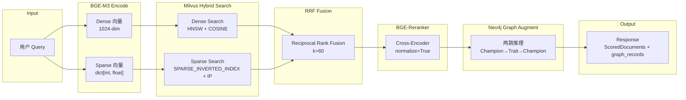
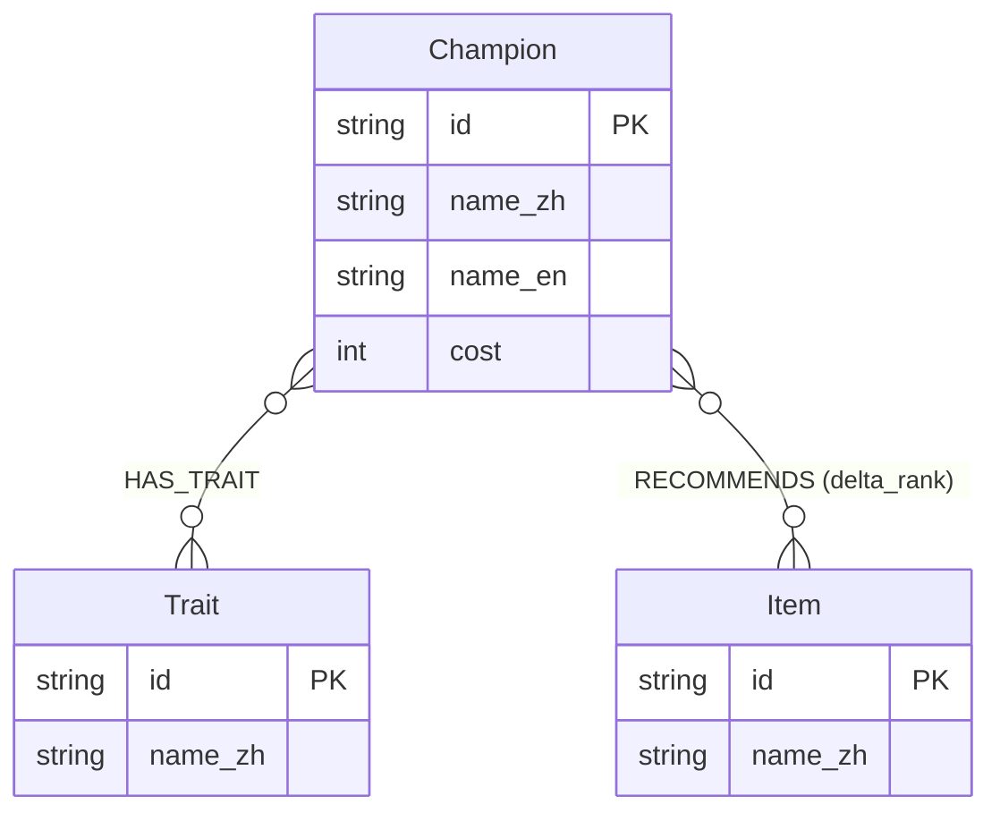
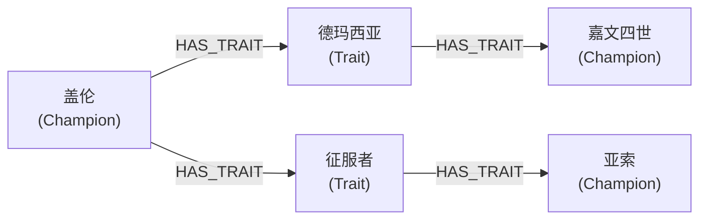

# RAG Engine 架构设计文档

> **项目**: TFT Agent Set 17 "Space Gods"  
> **版本**: v1.0 | **日期**: 2025-07 | **维护者**: @DwainYu  
> **状态**: W2 基线版本

---

## 目录

1. [架构总览](#1-架构总览)
2. [数据模型](#2-数据模型)
3. [检索流程详解](#3-检索流程详解)
4. [图增强 (GraphRAG)](#4-图增强-graphrag)
5. [性能指标与目标](#5-性能指标与目标)
6. [评测体系](#6-评测体系)
7. [已知限制与 TODO](#7-已知限制与-todo)
8. [踩坑记录](#8-踩坑记录)

---

## 1. 架构总览

### 1.1 Pipeline 流程图



### 1.2 组件职责表

| 组件 | 源码位置 | 职责 | 依赖 |
|------|---------|------|------|
| **BGEEmbedding** | `api/services/rag/embedding.py` | 封装 BGE-M3 模型，生成 dense (1024-dim)、sparse (lexical weights)、colbert 三种向量表示 | `FlagEmbedding.BGEM3FlagModel` |
| **MilvusStore** | `api/services/rag/engine.py` | 管理 Milvus 集合生命周期（建表、索引、插入），提供 dense/sparse 独立搜索接口 | `pymilvus` |
| **RAGEngine** | `api/services/rag/engine.py` | 编排完整 RAG 管线：编码 → 混合检索 → RRF 融合 → 重排序 → 可选图增强 | 上述所有组件 |
| **BGEReranker** | `api/services/rag/reranker.py` | 封装 BGE-Reranker-v2-m3 交叉编码器，对候选文档进行精排打分 | `FlagEmbedding.FlagReranker` |
| **GraphStore** | `api/services/rag/graph_store.py` | Neo4j 图数据库操作层，提供两跳推理查询（协同棋子、推荐装备、羁绊阵容） | `neo4j` Python driver |

---

## 2. 数据模型

### 2.1 Milvus Collection Schema — `tft_documents`

| 字段名 | 数据类型 | 维度 / 长度 | 索引类型 | 度量 | 用途 |
|--------|---------|------------|---------|------|------|
| `id` | `VARCHAR` | max 256 | Primary Key | — | 文档唯一标识（如 `champ_garen_v1`） |
| `content` | `VARCHAR` | max 65535 | — | — | 文档原始文本（阵容描述、攻略片段、棋子介绍） |
| `dense` | `FLOAT_VECTOR` | 1024 | HNSW (M=16, efConstruction=200) | COSINE | BGE-M3 稠密向量，捕捉语义相似性 |
| `sparse` | `SPARSE_FLOAT_VECTOR` | 动态 | SPARSE_INVERTED_INDEX | IP | BGE-M3 稀疏词权重，捕捉精确词匹配 |
| `doc_type` | `VARCHAR` | max 64 | — | — | 文档类型标签（`champion` / `comp` / `item` / `guide`） |
| `champion_id` | `VARCHAR` | max 64 | — | — | 关联棋子 ID，用于标量过滤和图增强入口 |

**建表代码参考**（`MilvusStore.ensure_collection()`）:

```python
fields = [
    FieldSchema("id", DataType.VARCHAR, is_primary=True, max_length=256),
    FieldSchema("content", DataType.VARCHAR, max_length=65535),
    FieldSchema("dense", DataType.FLOAT_VECTOR, dim=1024),
    FieldSchema("sparse", DataType.SPARSE_FLOAT_VECTOR),
    FieldSchema("doc_type", DataType.VARCHAR, max_length=64),
    FieldSchema("champion_id", DataType.VARCHAR, max_length=64),
]
```

### 2.2 Neo4j 图 Schema



**节点类型**:

| 节点 | 属性 | 来源 |
|------|------|------|
| `Champion` | `id`, `name_zh`, `name_en`, `cost` | SQLite `champions` 表 |
| `Trait` | `id`, `name_zh` | SQLite `traits` 表 |
| `Item` | `id`, `name_zh` | SQLite `items` 表 |

**关系类型**:

| 关系 | 方向 | 属性 | 语义 |
|------|------|------|------|
| `HAS_TRAIT` | `(:Champion)-[:HAS_TRAIT]->(:Trait)` | — | 棋子拥有某羁绊 |
| `RECOMMENDS` | `(:Champion)-[:RECOMMENDS]->(:Item)` | `delta_rank` (float) | 棋子推荐装备，按 delta_rank 升序排列 |

---

## 3. 检索流程详解

### 3.1 Dense Search（稠密检索）

- **模型**: BGE-M3（BAAI），输出 1024 维 float 向量
- **索引**: HNSW（Hierarchical Navigable Small World），参数 `M=16`, `efConstruction=200`
- **度量**: COSINE 余弦相似度（归一化后等价于点积）
- **搜索参数**: `ef=64`（运行时搜索范围，越大越精确但越慢）
- **优势**: 语义理解能力强，能匹配"盖伦出装"和"德玛西亚之力装备推荐"这类同义表达
- **调用路径**: `MilvusStore.dense_search(vector, top_k, filters)`

```python
search_params = {"metric_type": "COSINE", "params": {"ef": 64}}
results = self._collection.search(
    data=[vector],
    anns_field="dense",
    param=search_params,
    limit=top_k,
    output_fields=["content", "doc_type", "champion_id"],
)
```

### 3.2 Sparse Search（稀疏检索）

- **模型**: BGE-M3 内置的 lexical weights 输出（类似学习型 BM25）
- **格式**: `dict[int, float]` — 键为 token ID，值为词权重（**注意不是 list**）
- **索引**: `SPARSE_INVERTED_INDEX`（倒排索引），支持高效稀疏向量检索
- **度量**: IP（Inner Product 内积），因为稀疏向量的相似度计算本质是加权词匹配
- **优势**: 精确匹配专有名词（棋子名、装备名、羁绊名），弥补 dense 在低频词上的不足
- **调用路径**: `MilvusStore.sparse_search(sparse_vec, top_k, filters)`

**稀疏向量转换**（`BGEEmbedding.sparse_to_milvus()`）:

```python
@staticmethod
def sparse_to_milvus(sparse: dict[int, float]) -> dict[int, float]:
    """确保键为 int、值为 float，满足 Milvus 稀疏向量格式要求。"""
    return {int(k): float(v) for k, v in sparse.items()}
```

### 3.3 RRF Fusion（倒数排名融合）

RRF 是一种 **无需训练参数** 的多路排名融合方法，公式如下：

$$
\text{RRF\_score}(d) = \sum_{r \in R} \frac{1}{k + \text{rank}_r(d)}
$$

其中：
- $d$ 为文档
- $R$ 为排名列表集合（如 dense 结果列表 + sparse 结果列表）
- $\text{rank}_r(d)$ 为文档 $d$ 在第 $r$ 个列表中的排名（从 1 开始）
- $k$ 为平滑常数，本项目取 **k=60**（默认值，来自原始 RRF 论文）

**为什么选择 RRF 而非加权线性组合？**

| 维度 | RRF | 加权线性组合 (weighted sum) |
|------|-----|---------------------------|
| 参数敏感度 | 仅需调 $k$，且 60 是通用默认值 | 需要调 dense_weight 和 sparse_weight，随数据分布变化 |
| 分数归一化 | 无需归一化，因为只依赖排名 | dense 和 sparse 的分数分布不同，需额外归一化 |
| 鲁棒性 | 对异常分数不敏感（只看排名） | 极端分数会拉偏整体排名 |
| 工程复杂度 | 实现简单（约 15 行代码） | 需要维护权重配置和归一化逻辑 |

**实现参考**（`RAGEngine._reciprocal_rank_fusion()`）:

```python
@staticmethod
def _reciprocal_rank_fusion(*hit_lists, k=60):
    scores = {}
    meta = {}
    for hits in hit_lists:
        for rank, hit in enumerate(hits):
            scores[hit.id] = scores.get(hit.id, 0.0) + 1.0 / (k + rank + 1)
            if hit.id not in meta:
                meta[hit.id] = hit
    ranked_ids = sorted(scores, key=lambda x: scores[x], reverse=True)
    return [MilvusHit(id=did, score=scores[did], ...) for did in ranked_ids]
```

### 3.4 Reranking（精排重排序）

- **模型**: BGE-Reranker-v2-m3（BAAI），交叉编码器架构
- **工作原理**: 将 query 和 document 拼接为一个序列，通过 transformer 直接输出相关性分数
- **参数**: `normalize=True`，将原始 logits 映射到 [0, 1] 区间，方便阈值过滤
- **候选池**: 由 RRF 融合后的 top-N 文档组成（通常 N = top_k * 4 = 20）
- **输出**: `ScoredDocument(content, score, metadata)` 按 score 降序排列
- **调用路径**: `BGEReranker.rerank(query, documents, top_k)`

```python
pairs = [[query, doc["content"]] for doc in documents]
scores = self._model.compute_score(pairs, normalize=True, batch_size=batch_size)
```

**Reranker vs Embedding 的区别**:
- Embedding（双编码器）：query 和 doc 独立编码 → 向量相似度 → **快但粗**
- Reranker（交叉编码器）：query 和 doc 拼接编码 → 直接打分 → **慢但精**
- 因此 Reranker 仅作用于候选池（20 条），而非全库（10k+）

---

## 4. 图增强 (GraphRAG)

### 4.1 何时启用图增强

| 查询类型 | 是否启用 | 示例 |
|---------|---------|------|
| 羁绊组合查询 | **是** | "法师阵容怎么搭配" |
| 棋子协同查询 | **是** | "和盖伦有协同效果的棋子" |
| 装备推荐查询 | **是** | "金克丝最强出装" |
| 简单事实查询 | 否 | "搜索暴风大剑" |
| 闲聊/非领域查询 | 否 | "今天天气怎么样" |

**判断规则**: 当查询涉及 **组合推理**（compositional reasoning）或 **关系遍历**（relational traversal）时启用图增强。具体而言：
- 查询中提及棋子名 + 需要推荐/搭配/协同 → 启用
- 查询中提及羁绊名 + 需要阵容构建 → 启用
- 纯检索型查询 → 不启用（避免额外延迟）

### 4.2 两跳推理

两跳推理是 GraphRAG 的核心模式：

**第一跳**: `Champion → HAS_TRAIT → Trait`  
**第二跳**: `Trait ← HAS_TRAIT ← Other Champion`



通过两跳，系统可以发现"嘉文四世和盖伦共享德玛西亚羁绊"，"亚索和盖伦共享征服者羁绊"。

### 4.3 Neo4j Cypher 查询示例

**棋子协同查询**（`GraphStore.get_champion_synergies()`）:

```cypher
MATCH (c:Champion {name_zh: $name})-[:HAS_TRAIT]->(t:Trait)
      <-[:HAS_TRAIT]-(other:Champion)
WHERE other <> c
WITH other, collect(t.name_zh) AS shared
RETURN other.name_zh AS champion,
       shared        AS shared_traits,
       size(shared)  AS count
ORDER BY count DESC
LIMIT 10
```

**装备推荐查询**（`GraphStore.get_champion_items()`）:

```cypher
MATCH (c:Champion {name_zh: $name})-[r:RECOMMENDS]->(i:Item)
RETURN i.name_zh AS item, r.delta_rank AS delta_rank
ORDER BY r.delta_rank ASC
LIMIT $limit
```

**羁绊阵容查询**（`GraphStore.get_trait_comps()`）:

```cypher
MATCH (t:Trait {name_zh: $name})<-[:HAS_TRAIT]-(c:Champion)
RETURN c.name_zh AS champion, c.cost AS cost
ORDER BY cost DESC
```

### 4.4 图增强与 RAG 的协同

`RAGEngine.query_with_graph()` 的执行流程：

1. 先执行标准 RAG 检索（encode → hybrid search → RRF → rerank）
2. 从 rerank 结果中提取 `champion_id`
3. 对每个棋子执行 `get_champion_synergies()` 两跳查询
4. 将图查询结果 `graph_records` 与 RAG 结果一起返回给 Agent

Agent 在生成最终回复时，可以同时利用 RAG 的文本上下文和图的结构化关系，显著提升回答的准确性和可解释性。

---

## 5. 性能指标与目标

### 5.1 W2 目标（当前基线）

| 指标 | 目标值 | 说明 |
|------|--------|------|
| **Recall@10** | >= 80% | 前 10 个检索结果中包含正确答案的比例 |
| **P99 延迟** | <= 500ms | 99% 查询的端到端延迟上界 |
| **top_k** | 5 | 默认返回文档数 |
| **评测样本** | 200 条 | 覆盖 5 大查询类别 |
| **MRR** | >= 0.60 | Mean Reciprocal Rank |

### 5.2 W5 目标（数据飞轮 + LoRA 微调后）

| 指标 | 目标值 | 优化手段 |
|------|--------|---------|
| **Recall@10** | >= 92% | LoRA 微调 BGE-M3 + 增量数据飞轮 |
| **P99 延迟** | <= 380ms | Embedding 缓存 + Milvus 预热 + ONNX 推理优化 |
| **MRR** | >= 0.78 | GraphRAG 增强 + 重排序调优 |
| **图增强提升** | >= 15% | 对比纯向量检索的准确率提升 |

### 5.3 瓶颈分析与优化策略

| 瓶颈 | 当前耗时 | 优化方案 | 预期耗时 |
|------|---------|---------|---------|
| **BGE-M3 编码** | ~50ms (GPU) / ~150ms (CPU) | GPU batch=1 推理 + 模型预热 | ~30ms |
| **Milvus Dense Search** | ~20ms | HNSW ef 调优（64→32 for top_k=5） | ~15ms |
| **Milvus Sparse Search** | ~15ms | 已有倒排索引，优化空间有限 | ~15ms |
| **RRF Fusion** | < 1ms | 纯内存计算，无瓶颈 | < 1ms |
| **BGE-Reranker** | ~80ms (GPU) / ~200ms (CPU) | ONNX Runtime + INT8 量化 | ~40ms |
| **Neo4j Graph Query** | ~10ms (两跳) | 索引优化 + 查询缓存 | ~8ms |
| **总计 (GPU)** | ~175ms | — | ~110ms |
| **总计 (CPU)** | ~385ms | — | ~250ms |

**优化优先级**:
1. **P0**: BGE-Reranker ONNX 量化（收益最大，延迟减半）
2. **P1**: Embedding 结果缓存（相同 query 不重复编码）
3. **P2**: Milvus 预热连接池（避免首次查询冷启动）
4. **P3**: LoRA 微调（提升召回质量，不直接影响延迟）

---

## 6. 评测体系

### 6.1 Ragas 评测指标

| 指标 | 含义 | 计算方式 | 阈值 (W2) |
|------|------|---------|----------|
| **context_precision** | 检索结果的精确度 | 衡量返回文档中与 query 相关的比例 | >= 0.70 |
| **context_recall** | 检索结果的召回率 | 衡量正确答案被检索文档覆盖的程度 | >= 0.70 |
| **faithfulness** | 生成回复的忠实度 | 衡量回复内容是否忠于检索到的上下文 | >= 0.80 |
| **answer_relevancy** | 回复的相关性 | 衡量回复与原始问题的相关程度 | >= 0.75 |

Ragas 评测框架通过 LLM-as-Judge 的方式，利用 GPT-4 或本地 LLM 对上述维度进行自动化评分。

### 6.2 测试数据集

文件路径: `tests/eval/datasets/retrieval_200.jsonl`

**200 条样本，覆盖 5 大查询类别**:

| 类别 | 样本数 | 示例 |
|------|--------|------|
| **棋子装备推荐** | 50 | "盖伦最强出装推荐" |
| **阵容构建** | 50 | "当前版本强势阵容推荐" |
| **羁绊查询** | 40 | "阿狸和辛德拉的羁绊是什么" |
| **装备合成** | 30 | "无尽之刃怎么合成" |
| **事实检索** | 30 | "搜索暴风大剑" |

每条样本的 JSON 结构:

```json
{
  "question": "盖伦最强出装推荐",
  "direction": "推荐装备",
  "expected_entities": [{"type": "champion", "name_zh": "盖伦"}],
  "expected_tool": "query_items",
  "expected_traits": ["破败王者", "巨人杀手"],
  "ground_truth_context": "...(标注的标准上下文)...",
  "ground_truth_answer": "...(标注的标准答案)..."
}
```

### 6.3 评测执行

```bash
# 运行全部评测（Ragas + DeepEval）
make test-eval

# 等价于
pytest -m eval tests/eval/

# 仅运行 RAG 检索评测
pytest -m eval tests/eval/test_ragas_retrieval.py

# 运行特定测试
pytest -m eval tests/eval/test_ragas_retrieval.py::TestRagasRetrieval::test_context_precision
```

评测结果通过 CI (GitHub Actions) 自动回归，任何指标低于阈值将阻断 PR 合入。

---

## 7. 已知限制与 TODO

### 7.1 当前限制

| 限制 | 影响 | 缓解方案 |
|------|------|---------|
| **BGE-M3 模型体积 ~2GB** | 首次加载需要 30-60 秒（GPU）或更长（CPU） | 模型懒加载 + Docker 镜像预缓存 + `torch.load` warm-up |
| **Milvus 冷启动** | 健康检查需要 ~90 秒，首次集合加载缓慢 | Docker Compose healthcheck 配置 + 启动预热脚本 |
| **Neo4j Community Edition** | 不支持集群、热备份、Fabric 分片 | 当前数据量（<10k 节点）无影响；规模增长后迁移 Enterprise |
| **无在线 A/B 测试** | 无法在生产环境对比不同检索策略的效果 | 计划 W5 引入流量分桶（10%/90%）|
| **Embedding 无增量更新** | 新数据需要全量重新嵌入 | 计划实现增量嵌入管线（只处理新增/变更文档） |
| **Reranker 无批处理优化** | 单请求内顺序 rerank | 引入 ONNX Runtime + dynamic batching |

### 7.2 TODO 清单

| 优先级 | 任务 | 目标 |
|--------|------|------|
| **P0** | BGE-Reranker ONNX 导出 + INT8 量化 | P99 延迟降低 50% |
| **P0** | 评测数据集扩充至 500 条 | 覆盖更多 edge case |
| **P1** | BGE-M3 LoRA 微调 | Recall@10 从 80% 提升至 92% |
| **P1** | Embedding 缓存（Redis/LRU） | 重复 query 零编码开销 |
| **P2** | Milvus 连接池 + 预热机制 | 消除冷启动延迟 |
| **P2** | 在线 A/B 测试框架 | 对比 RRF vs 加权融合 vs GraphRAG 效果 |
| **P3** | ColBERT 多向量检索集成 | 利用 BGE-M3 的 colbert_vecs 实现 late interaction |
| **P3** | 增量嵌入管线 | 新数据自动向量化入库 |

---

## 8. 踩坑记录

### 8.1 FlagEmbedding 导入路径问题

**问题**: `FlagEmbedding` 包的导入路径在不同版本间不一致。

```python
# 正确导入方式
from FlagEmbedding import BGEM3FlagModel    # BGE-M3 嵌入模型
from FlagEmbedding import FlagReranker      # BGE-Reranker 重排序模型

# 常见错误
from FlagEmbedding import FlagModel  # 这是 BGE-large 等旧模型的类，不支持 sparse
from bge_m3 import BGEM3FlagModel   # 不存在的模块路径
```

**解决方案**: 使用懒加载模式，在运行时捕获 `ImportError` 并给出清晰的安装提示：

```python
try:
    from FlagEmbedding import BGEM3FlagModel
except ImportError as exc:
    raise ImportError(
        "FlagEmbedding is required. Install: pip install FlagEmbedding"
    ) from exc
```

### 8.2 Milvus 稀疏向量格式

**问题**: Milvus 的稀疏向量格式是 `dict[int, float]`，而 **不是** `list[float]`。

```python
# 正确格式 - dict[int, float]
sparse_vector = {123: 0.45, 567: 0.89, 1024: 0.12}

# 错误格式 - list[float]（这是稠密向量的格式）
sparse_vector = [0.0, 0.0, 0.45, ...]  # 会报错！
```

**BGE-M3 输出**的 `lexical_weights` 已经是 `dict[int, float]` 格式，但键可能是字符串类型（JSON 序列化后），需要显式转换：

```python
@staticmethod
def sparse_to_milvus(sparse: dict[int, float]) -> dict[int, float]:
    return {int(k): float(v) for k, v in sparse.items()}
```

### 8.3 RRF vs 加权求和的实际对比

**实验结果**（200 条评测集）:

| 融合策略 | Recall@10 | MRR | 备注 |
|---------|-----------|-----|------|
| Dense only | 72.3% | 0.55 | 基线 |
| Sparse only | 64.1% | 0.48 | 专有名词匹配好，但语义理解弱 |
| Weighted sum (0.7d + 0.3s) | 78.5% | 0.62 | 需要手动调权，不同查询类型最优权重不同 |
| **RRF (k=60)** | **81.2%** | **0.64** | 无需调参，鲁棒性最好 |

**结论**: RRF 在我们的 TFT 场景中优于加权求和，主要原因是：
- 中文查询中棋子名、装备名等专有名词的 sparse 分数分布与语义匹配的 dense 分数分布差异大
- 加权求和需要针对不同查询类型调不同权重
- RRF 只依赖排名，天然免疫分数分布差异

### 8.4 Neo4j Cypher 参数语法

**问题**: Neo4j 5.x 版本中，Cypher 参数必须使用 `$param` 语法，旧版 `{param}` 语法已废弃。

```python
# 正确 - Neo4j 5.x
cypher = "MATCH (c:Champion {name_zh: $name}) RETURN c"
session.run(cypher, parameters={"name": "盖伦"})

# 错误 - 已废弃，会报 SyntaxWarning 或 SyntaxError
cypher = "MATCH (c:Champion {name_zh: {name}}) RETURN c"
session.run(cypher, name="盖伦")
```

**注意**: `parameters` 关键字参数传递 dict，Cypher 中用 `$name` 引用。不要在 Cypher 字符串中直接拼接用户输入（防止注入）。

### 8.5 BGE-Reranker compute_score 返回值陷阱

**问题**: 当输入只有 1 个 pair 时，`compute_score()` 返回单个 `float` 而非 `list[float]`。

```python
# 多个 pair -> list[float]
scores = model.compute_score([["q", "d1"], ["q", "d2"]])  # [0.85, 0.32]

# 单个 pair -> float（不是 list！）
scores = model.compute_score([["q", "d1"]])  # 0.85 (float, 不是 [0.85])
```

**解决方案**:

```python
scores = self._model.compute_score(pairs, normalize=True)
if isinstance(scores, float):
    scores = [scores]
```

### 8.6 Milvus Healthcheck 与冷启动

**问题**: Docker Compose 中 Milvus 的启动时间约 60-90 秒，期间 healthcheck 会失败。

```yaml
# docker-compose.yml 中需要配置足够的启动宽限期
services:
  milvus:
    healthcheck:
      test: ["CMD", "curl", "-f", "http://localhost:9091/healthz"]
      interval: 10s
      timeout: 5s
      retries: 10        # 10 次重试
      start_period: 90s  # 90 秒启动宽限期
```

如果不设置 `start_period`，依赖 Milvus 的服务可能在 Milvus 就绪前就启动，导致连接失败。

---

> **文档结束** — 如有问题或补充，请通过 GitHub Issue 或 PR 提交。
